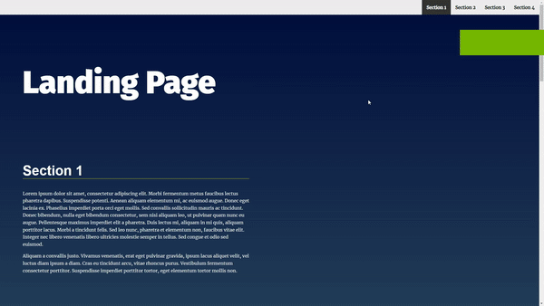

# Landing Page Project

# Table of contents

- [Project Overview](#quick-overview)
- [Dependencies](#dependencies)
- [Usage](#usage)

## Quick overview

multi-section landing webpage that can dynamically change according to the user interactions with the webpage

- Building navigation according the sections found in the DOM
- Changing styles on user scroll
- Smooth scroll behavior to improve user experience

## Dependencies 

- None required

## Usage

No dependencies required its only vanilla javaScript

Interact with user according to event and actions happening on the page.
